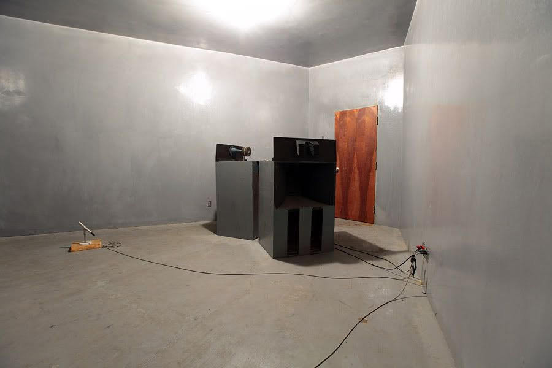

# **WEEK 4**

## **Mechanical Reverb**

**Turning Space into a Device**

https://www.acontinuouslean.com/2013/12/02/secret-capitol-studios-sound/
https://applink.reverb.com/ca/news/6-echo-chambers-that-shaped-the-sound-of-popular-music

---
# Why Simulate Space

- Consistency
- Portability
- Control

---
# Springs as Delay Lines

- Mechanical wave propagation
- Dispersion
- Loss

---

# Transducers and Magnets

- Electrical to mechanical
- Mechanical back to electrical

---

# Exercises: Listening

- Spring reverb guitar tones
- Surf music

---

# Exercises: Hands-on

- Simple spring + transducer experiment
- Compare to room reverb

---

# Exercises: Reflection

- What is gained?
- What is lost?

---
# WEEK 4 – SPRING REVERB, MECHANICS → ELECTRONICS

Concept: Electromechanical sound processing

---
# Spring Reverb Fundamentals
	•	https://sound-au.com/articles/spring-reverb.htm
Outstanding explanation of springs as physical delay lines.

---
# Simple Spring Driver / Recovery
	•	https://www.electrosmash.com/reverb-analysis
	•	https://www.valvewizard.co.uk/reverb.html

Why these matter
	•	Explains springs as dispersive mechanical systems
	•	Bridges acoustics, magnetics, and electronics
	•	Complements your “space → device” narrative

---
## Week 4 hands-on: spring reverb experiment

A “real” spring tank driver/recovery can get involved, but you can do a very workable educational version.

---
## Schematic A: Spring driver (LM386)

---
## Circuit
	•	Input -> C1 100 nF -> LM386 pin 3
	•	Pin 2 to GND
	•	Volume: R1 10 k pot as input level (optional)
	•	Gain set: C2 10 uF between pins 1 and 8 (max gain)
	•	Output (pin 5) -> C3 220 uF -> series R2 33 ohm -> spring input transducer
	•	Spring other side to GND

---
## Power
	•	Pin 6 to +9 V
	•	Decouple: C4 100 nF + C5 100 uF from +9 V to GND at chip

---
## Schematic B: Spring recovery (op amp gain + tone)

---
## Use TL072 (one half), biased at VB.

Input
	•	Spring output transducer -> C6 100 nF -> op amp (+)
	•	R3 1 M from op amp (+) to VB

Gain
	•	Non-inverting gain:
	•	R4 10 k from op amp (-) to VB
	•	R5 220 k from op amp output to op amp (-)
	•	Gain ≈ 1 + (220k/10k) = 23

Output
	•	Op amp output -> C7 1 uF -> Mix pot 100 kA (optional) -> output

---
## Notes
	•	You can keep it educational by mixing wet and dry externally.
	•	Spring tanks vary wildly. If recovery is noisy, reduce gain (R5 100 k).
